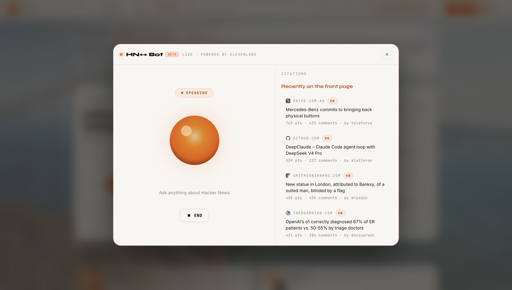

# HN++

**Hacker News, now with a voice.**

> Built for ElevenHacks 2026 — live prototype, not a demo.

[](https://hnpp.app)
[](https://elevenlabs.io)
[](https://deepmind.google/technologies/gemini/)
[](https://firecrawl.dev)
[](https://nextjs.org)
[](https://cloudflare.com)
[](https://elevenlabs.io)

> Hacker News is one of the best places on the internet. But it's a wall of text.
>
> You can't listen to it on a commute. You can't ask it a question. There's no daily briefing. The content is great — the surface hasn't changed in 15 years.
>
> **HN++ changes that.**

HN++ is a calm, glassmorphic redesign of Hacker News with three AI audio products layered on top: per-article narration you can play in two taps, a fully automated daily podcast with a host and rotating guest, and a conversational bot that knows what's on HN right now. Same community. Same firehose. Now you can actually listen.

<!-- Screenshot: HN++ hero — replace with actual screenshot -->
<p align="center">
  
</p>

---

## Table of Contents

- [What is HN++?](#what-is-hn)
- [How It Works](#how-it-works)
- [Key Features](#key-features)
- [Audio Pipelines](#audio-pipelines)
- [ElevenLabs Integration](#elevenlabs-integration)
- [Tech Stack](#tech-stack)
- [Screenshots](#screenshots)
- [Running Locally](#running-locally)
- [License](#license)

---

## What is HN++?

HN++ has three distinct products built on top of the official Hacker News Firebase API:

- **Highlights** — curated daily view of the top stories across 6 categories, with per-story Listen buttons.
- **Feed** — the full live HN firehose with voice search (ElevenLabs Scribe), Listen on every post, and collapsible comment threads.
- **HN++ Pod** — a fully automated daily podcast. Every morning a GitHub Actions cron scrapes the top 8 stories, Gemini Flash writes a multi-voice dialogue script, and ElevenLabs `eleven_v3` text-to-dialogue renders it as a 10–15 min MP3 with chapter markers. Served from Cloudflare R2.
- **HN++ Bot** — a conversational AI agent (ElevenLabs Conversational AI) that knows what's on HN right now. Ask it anything: trending stories, who's hiring, what the community is debating.

---

## How It Works

**1. Browse** — Open Highlights or Feed. Live data from the official HN Firebase API — same stories, same scores, same comments.

**2. Listen (per article)** — Tap the Listen button on any story. Firecrawl scrapes the linked article, Gemini Flash writes a 180–220-word narration blending article content with comment sentiment, ElevenLabs Flash v2.5 streams it back. First audio byte in under 3 seconds.

**3. Search by voice** — Tap the mic in the feed search bar. ElevenLabs Scribe (`scribe_v1`) transcribes your query and filters the feed instantly.

**4. Listen to the Pod** — Today's HN++ Pod is pre-baked every day at 1:30 AM GMT. Open the Podcast tab, hit play. Chapter markers let you skip to any story segment. Last 7 days are always available.

**5. Talk to the Bot** — Hit the HN++ Bot button. ElevenLabs Conversational AI connects. Ask what's trending, who's hiring, what the top thread is about — it answers in real time with live HN context.

---

## Key Features

| Feature | Description |
|---------|-------------|
| **Listen** | Tap any story for a 60–90s AI narration — article summary + comment sentiment, streamed via ElevenLabs Flash |
| **Voice Search** | Speak your search query — ElevenLabs Scribe transcribes it live |
| **HN++ Pod** | Automated daily 10–15 min multi-voice podcast — host Anchor Aiden + rotating guest |
| **Chapter Markers** | Skip directly to any of the 8 story segments in the podcast player |
| **HN++ Bot** | Conversational AI agent with live HN context — ask anything |
| **Highlights View** | Curated top stories across 6 categories with a clean card grid |
| **Live HN Data** | Direct Firebase API — no cache lag, same ranking as hacker news |
| **Glassmorphic UI** | Warm SF palette, frosted-glass surfaces, dark/light mode |

---

## Audio Pipelines

### Listen — per article, on demand

```
User taps Listen
  → POST /api/listen { storyId }
  → getStoryThread(storyId)                          // HN Firebase API
  → scrapeArticle(url, 4s timeout, markdown, fast)   // Firecrawl
  → summarizeForListen({ article, comments, story }) // Gemini Flash, thinkingLevel LOW
  → narrationToBuffer(summary)                       // ElevenLabs eleven_flash_v2_5
  → mp3 buffer streamed to <audio>, cached by story hash
```

Firecrawl failure (paywall/timeout) → Gemini falls back to title + comments only.
Target: ≤ 3s to first audio byte.

### HN++ Pod — daily multi-voice, pre-baked

```
GitHub Actions cron (01:30 UTC daily)
  → POST /api/podcast/cron  (Bearer auth)
  → idempotency check — skip if today's manifest exists
  → castForDate(date) → host: Anchor Aiden + rotating guest
  → getStoriesByFeed('top', 8) — 8 top stories
  → parallel scrapeArticles + getStoryThread (concurrency 5)
  → buildDialogueScript(stories, dateLabel, host, guest)
       Gemini Flash, thinkingLevel HIGH
       → { intro[], segments[8], outro[] }
  → renderDialogue(script, voices)
       chunk by sentence, ≤1900 chars per API call
       → eleven_v3 textToDialogue.convertWithTimestamps per chunk
       → concat MP3s, compute segment startMs/endMs
  → store mp3 + manifest to Cloudflare R2
  → manifest: { date, runtimeMs, storyTitles, host, guest, segments[] }
```

Listeners pull via `GET /api/podcast/today`, `/api/podcast/archive`, `/api/podcast/audio/{date}.mp3`.

---

## ElevenLabs Integration

Four ElevenLabs products are active in production:

| Product | Model / API | Where Used |
|---------|-------------|------------|
| **Flash TTS** (`eleven_flash_v2_5`) | `textToSpeech.convert` with `optimizeStreamingLatency=4` | Listen — per-article narration streamed on demand |
| **Text-to-Dialogue** (`eleven_v3`) | `textToDialogue.convertWithTimestamps` | HN++ Pod — multi-voice host/guest podcast, chapter timings |
| **Scribe STT** (`scribe_v1`) | `speechToText.convert` | Voice search in the Feed — mic input → query text |
| **Conversational AI** | `@elevenlabs/client` `Conversation.startSession` | HN++ Bot — real-time agent with live HN context |

---

## Tech Stack

| Category | Technology |
|----------|-----------|
| **Framework** | Next.js 15 (App Router), React 19, TypeScript strict |
| **Styling** | Tailwind CSS 4, shadcn/ui (new-york, neutral) |
| **TTS / Narration** | ElevenLabs `eleven_flash_v2_5` |
| **Dialogue / Podcast** | ElevenLabs `eleven_v3` text-to-dialogue |
| **STT / Voice Search** | ElevenLabs `scribe_v1` |
| **Conversational AI** | ElevenLabs Conversational AI (`@elevenlabs/client`) |
| **AI Scripting** | Google Gemini Flash (`gemini-flash-latest`), tunable `thinkingLevel` |
| **Article Scraping** | Firecrawl (`@mendable/firecrawl-js`), markdown-only, fast mode |
| **HN Data** | Official HN Firebase API + Algolia |
| **Podcast Storage** | Cloudflare R2 (mp3 + manifest JSON) |
| **Cron** | GitHub Actions (`30 1 * * *` = 01:30 UTC = 7 AM IST) |
| **Data Fetching** | SWR |
| **Validation** | Zod (all API route boundaries) |
| **Package Manager** | pnpm |

---

## Screenshots

<!-- Replace these with actual screenshots -->

**Highlights — story grid**
<p align="center">
  
</p>

**Feed — live HN with Listen**
<p align="center">
  
</p>

**HN++ Pod — podcast player with chapters**
<p align="center">
  
</p>

**HN++ Bot — conversational AI**
<p align="center">
  
</p>

**Landing page**
<p align="center">
  
</p>

---

## Running Locally

**Prerequisites:** Node 20+, pnpm, API keys for ElevenLabs, Firecrawl, Gemini

```bash
# Install dependencies
pnpm install

# Configure environment
cp .env.example .env.local
# Fill in your API keys (see below)

# Start dev server
pnpm dev
# or: ./start.sh  (kills :3000 first, then starts)
```

### Environment Variables

```env
# ElevenLabs
ELEVENLABS_API_KEY=...
NEXT_PUBLIC_ELEVENLABS_AGENT_ID=...   # HN++ Bot (Conversational AI agent ID)

# Google Gemini
GEMINI_API_KEY=...

# Firecrawl
FIRECRAWL_API_KEY=...

# Podcast cron (guards POST /api/podcast/cron)
CRON_SECRET=...

# Cloudflare R2 (optional — falls back to local filesystem)
R2_ACCOUNT_ID=...
R2_ACCESS_KEY_ID=...
R2_SECRET_ACCESS_KEY=...
R2_BUCKET=...
R2_PUBLIC_BASE_URL=...

# Podcast store path (optional — defaults to ./.podcast-store)
PODCAST_STORE_DIR=...
```

### Baking a podcast episode manually

```bash
# Bake today's episode (IST date)
pnpm tsx scripts/bake-episode.ts

# Bake a specific date
pnpm tsx scripts/bake-episode.ts --date 2026-05-04

# Force regenerate even if cached
pnpm tsx scripts/bake-episode.ts --force
```

> **Note:** The podcast cron is idempotent — it returns `{cached: true}` if today's episode already exists. Never call it with `--force` on a date that already has an MP3; it re-bills all three APIs.

### Other commands

```bash
pnpm build   # production build
pnpm lint    # eslint
```

---

## License

<p>
  <a href="https://opensource.org/licenses/MIT">
    
  </a>
</p>

Licensed under the [MIT License](https://opensource.org/licenses/MIT).

Built by [Limb](https://x.com/__padmanabhan) for ElevenHacks 2026. Not affiliated with Y Combinator.
